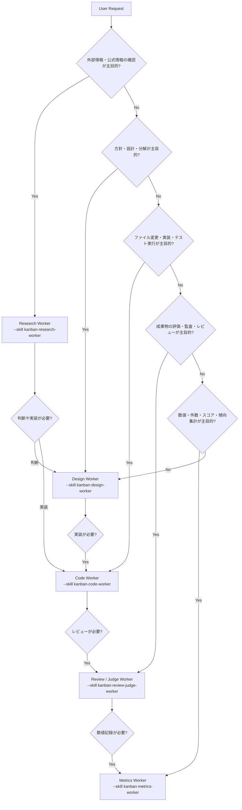

# Hermes Kanban Task Routing Playbook v1

> Hermes Kanbanで「どのtaskをどのworkerへ渡すか」を迷わず判断するための運用マニュアルです。  
> Phase 2で追加した role-specific skill を、既存のKanban workerに task単位で付与する前提です。

## 0. 基本方針

- **コード変更ではなく運用ルール**として使う。
- まずは **少ないworker roster + task別skill** で始める。
- worker profileを増やす前に、`--skill kanban-...-worker` で役割を狭める。
- 危険操作、外部公開、Git push、deploy、cron変更、課金操作は明示承認なしに実行しない。
- 依存関係があるtaskは `--parent <task_id>` でつなぐ。

標準の流れは次です。

```text
Design → Code → Review/Judge → Metrics
          ↑         ↓
       Research   Repair Code
```

---

## 1. Worker一覧

| worker名 | skill名 | 主担当 | やってはいけないこと | 典型例 |
|---|---|---|---|---|
| Design Worker | `kanban-design-worker` | 設計、方針整理、タスク分解、リスク整理、実装前の計画 | 直接コードを書く、Git操作、cron変更、外部送信、本番操作 | 設計相談、実装方針、リファクタリング計画、Constitution変更方針、cron改善案 |
| Code Worker | `kanban-code-worker` | 実装、バグ修正、テスト、ログ確認、READMEなど実ファイル更新 | Git push、deploy、branch変更、破壊的操作、課金API実行、cron変更を無断で行う | バグ修正、README更新、テスト追加、Benchmark実行、Discord通知改善の実装 |
| Research Worker | `kanban-research-worker` | 情報収集、公式ドキュメント確認、OSS/ライブラリ調査、Fact/Unknown/Inference分離 | 推測をFact扱いする、最終判断を勝手に下す、外部公開する | ライブラリ調査、OSS調査、API仕様確認、代替案比較、GitHub Issue背景調査 |
| Review / Judge Worker | `kanban-review-judge-worker` | 成果物レビュー、品質監査、Constitution/Guard準拠確認、PR/diffレビュー | 実装修正する、Constitutionを直接変更する、Git操作する、レビュー対象外まで広げる | コードレビュー、PRレビュー、品質監査、設計レビュー、出力採点、Guard違反チェック |
| Metrics Worker | `kanban-metrics-worker` | 測定値の記録、スコア/件数/傾向集計、品質ログ整理 | 採点する、改善案を自動適用する、推測値を記録する、時系列を混ぜる | Weekly Metrics、Benchmark結果集計、Memory操作数集計、Constitution違反数集計 |

### 使い分けの短い覚え方

| 判断軸 | 渡す先 |
|---|---|
| 何を作るべきか迷っている | Design |
| 実際にファイルを変える | Code |
| 外部情報や公式情報を調べる | Research |
| 出来上がったものを評価する | Review / Judge |
| 数値を記録・集計する | Metrics |

---

## 2. Task Routing Rule

### 2.1 依頼タイプ別ルーティング表

| 依頼 | Primary worker | Secondary / follow-up | ルーティング理由 |
|---|---|---|---|
| 設計相談 | Design | Review/Judge | 方針整理が主目的。重要設計ならレビューを後続にする。 |
| 仕様整理 | Design | Research | 要件と制約を整理。外部仕様が必要ならResearchを先に置く。 |
| タスク分解 | Design | Metrics | 実装前に作業単位へ分解。進捗測定が必要ならMetrics。 |
| バグ修正 | Code | Review/Judge | 実装修正とテストが主目的。完了後にレビュー。 |
| ログ調査 | Code | Research | ローカルログ/実行結果ならCode。外部仕様原因ならResearch。 |
| リファクタリング | Design → Code | Review/Judge | 先に範囲と安全策を決め、Codeが小さく変更し、Reviewで確認。 |
| テスト追加 | Code | Review/Judge | ファイル変更と実行検証が主目的。 |
| ライブラリ調査 | Research | Design | 公式情報・互換性・ライセンス確認が主目的。採用判断はDesignへ。 |
| OSS調査 | Research | Review/Judge | issue、release、README、licenseなど一次情報確認。 |
| GitHub Issue対応 | Design → Code | Research, Review/Judge | Issueの意図整理後に実装。外部Issue背景はResearch。 |
| PRレビュー | Review/Judge | Code | 差分評価が主目的。修正が必要なら別のCode follow-up。 |
| コードレビュー | Review/Judge | Code | レビューworkerは修正しない。指摘後にCodeへ。 |
| README更新 | Code | Review/Judge | Markdownファイル変更が主目的。内容方針が曖昧ならDesignを先行。 |
| ドキュメント整備 | Design → Code | Review/Judge | 構成設計後にMarkdown作成。 |
| Benchmark実行 | Code | Metrics | 実行はCode、数値整理はMetrics。 |
| Benchmark結果分析 | Metrics | Review/Judge | 数値集計が主目的。評価・解釈が必要ならReview/JudgeまたはDesign。 |
| 品質監査 | Review/Judge | Metrics | 評価・違反確認が主目的。数値記録はMetrics。 |
| Memory整理 | Review/Judge | Metrics | 重複・古さ・適用可否をレビュー。件数集計はMetrics。実削除は承認後。 |
| Constitutionレビュー | Review/Judge | Design | 準拠確認・矛盾抽出はReview。改定方針はDesign。 |
| Constitution改定案 | Design | Review/Judge | ルール追加より既存改善を優先して案を作る。直接適用しない。 |
| 品質メトリクス集計 | Metrics | Review/Judge | Question Count、Memory操作数、Guard判断数などを記録。 |
| cron改善 | Design → Code | Review/Judge | cron変更は影響があるため、先に設計。実変更は明示承認後にCode。 |
| Discord通知改善 | Design → Code | Review/Judge | 通知仕様を決めてから実装。送信先変更は注意。 |
| Gateway/daemon調査 | Code | Review/Judge | ログ・プロセス・設定確認が主目的。ただしrestartは人間承認優先。 |
| 外部API仕様確認 | Research | Design | 公式ドキュメント確認後に採用判断。 |
| 投資/ニュース調査 | Research | Design | 事実収集と判断を分離。Researchは提案しない。 |
| 週次品質レポート | Metrics | Review/Judge | 数値集計後、品質評価をReview/Judgeへ。 |

### 2.2 迷ったときのルール

1. **成果物がコード/ファイル変更なら Code。**
2. **成果物が判断材料なら Research。**
3. **成果物が方針/設計/順序なら Design。**
4. **成果物が評価/採点/指摘なら Review/Judge。**
5. **成果物が数値/件数/時系列なら Metrics。**

迷った場合は、いきなりCodeに渡さず **Designで小さく整理** する。

---

## 3. Task Template

以下は `hermes kanban create` の実運用テンプレートです。  
`--assignee <worker-profile>` は、この環境に存在するworker profile名に置き換えてください。

> 注意: `--skill` は repeatable です。ここではPhase 2のrole-specific skillを1つ付ける最小形にしています。

### 3.1 Design Template

```bash
hermes kanban create "design: <短い目的>" \
  --assignee <worker-profile> \
  --skill kanban-design-worker \
  --body "目的: <何を決めたいか>
制約: <変更禁止/予算/時間/安全条件>
期待成果物: 実装方針、分割task、リスク、次workerへのhandoff
禁止: 直接コード変更、Git操作、cron変更、外部送信"
```

### 3.2 Code Template

```bash
hermes kanban create "code: <実装または修正内容>" \
  --assignee <worker-profile> \
  --skill kanban-code-worker \
  --body "目的: <変更内容>
対象: <repo/path/機能>
受け入れ条件: <テスト/実行結果/確認条件>
制約: 最小変更、検証必須、Git push禁止、deploy禁止、cron変更禁止
完了報告: changed files、実行した検証、残課題"
```

### 3.3 Research Template

```bash
hermes kanban create "research: <調査テーマ>" \
  --assignee <worker-profile> \
  --skill kanban-research-worker \
  --body "目的: <何を調べるか>
優先情報源: 公式情報、一次情報、信頼できる技術資料
出力形式: Fact / Unknown / Inference / Sources / 次に確認すべきこと
禁止: 推測をFact扱いしない、最終判断を勝手に下さない、外部送信しない"
```

### 3.4 Review / Judge Template

```bash
hermes kanban create "review: <レビュー対象>" \
  --assignee <worker-profile> \
  --skill kanban-review-judge-worker \
  --parent <parent_task_id> \
  --body "目的: <成果物/diff/設計/出力のレビュー>
レビュー対象: <path/task_id/summary>
観点: 目的達成、Constitution/Guard準拠、リスク、検証不足、scope creep
出力形式: Verdict / Blocking issues / Optional improvements / Evidence
禁止: 実装修正、Git操作、Constitution直接変更"
```

### 3.5 Metrics Template

```bash
hermes kanban create "metrics: <集計対象>" \
  --assignee <worker-profile> \
  --skill kanban-metrics-worker \
  --body "目的: <どの期間/対象を集計するか>
対象指標: <Question Count / Memory actions / Guard decisions / Scores / Benchmark results>
期間: <YYYY-MM-DD〜YYYY-MM-DD or N/A>
出力形式: Metric / Value / Source / Time window / N/A reason
禁止: 推測値の記録、改善案の自動適用、採点の独自実施"
```

### 3.6 依存つきパイプライン例

```bash
DESIGN_ID=$(hermes kanban create "design: Discord通知改善の方針" \
  --assignee <worker-profile> \
  --skill kanban-design-worker \
  --body "Discord通知改善の目的、制約、実装方針、リスクを整理する。コード変更は禁止。" \
  --json | python3 -c 'import json,sys; print(json.load(sys.stdin)["id"])')

CODE_ID=$(hermes kanban create "code: Discord通知改善を実装" \
  --assignee <worker-profile> \
  --skill kanban-code-worker \
  --parent "$DESIGN_ID" \
  --body "親taskの設計に従って最小実装する。検証結果とchanged filesを報告する。Git pushは禁止。" \
  --json | python3 -c 'import json,sys; print(json.load(sys.stdin)["id"])')

hermes kanban create "review: Discord通知改善の実装レビュー" \
  --assignee <worker-profile> \
  --skill kanban-review-judge-worker \
  --parent "$CODE_ID" \
  --body "実装差分、検証結果、運用リスクをレビューする。修正は行わない。"
```

---

## 4. Routing Decision Flow

### Mermaid



### ASCII版

```text
User Request
  |
  |-- 調査が主目的? ------------------> Research
  |                                      |
  |                                      v
  |-- 設計/分解が必要? ---------------> Design
  |                                      |
  |                                      v
  |-- 実装/テスト/修正が必要? --------> Code
  |                                      |
  |                                      v
  |-- 評価/監査/レビューが必要? ------> Review/Judge
  |                                      |
  |                                      v
  |-- 数値/件数/傾向集計が必要? ------> Metrics
  |
  +-- 迷ったら Design で小さく整理
```

---

## 5. Handoff Rule

### 5.1 標準handoff chain

| Chain | 使う場面 | 流れ |
|---|---|---|
| Minimal code | 小さな修正 | Code → Review/Judge |
| Safe implementation | 影響範囲がある変更 | Design → Code → Review/Judge |
| Research-driven | 外部仕様・OSS判断が必要 | Research → Design → Code → Review/Judge |
| Quality loop | 品質改善・Constitution運用 | Review/Judge → Design → Code → Review/Judge → Metrics |
| Benchmark loop | 性能/品質測定 | Code → Metrics → Review/Judge |
| Weekly quality | 定期品質確認 | Metrics → Review/Judge → Design |

### 5.2 worker別handoff内容

#### Design → Code

Design Workerは完了時に次を残す。

- 目的
- 変更対象pathまたは対象機能
- 実装方針
- 禁止事項
- 受け入れ条件
- 未確定事項

Follow-up Code taskを作るタイミング:

- 実装方針が1つに絞れた
- 変更対象が具体化した
- 人間判断が不要、または承認済み

#### Research → Design

Research Workerは完了時に次を残す。

- Fact
- Unknown
- Inference
- Sources
- 判断に必要な残確認

Follow-up Design taskを作るタイミング:

- 複数案の比較が必要
- 調査結果から採用/不採用の判断が必要
- 実装順序やリスク整理が必要

#### Code → Review/Judge

Code Workerは完了時に次を残す。

- changed files
- 実行したコマンド
- テスト/検証結果
- 未検証範囲
- 既知のリスク

Follow-up Review taskを作るタイミング:

- ファイル変更がある
- テスト結果だけでは品質判断できない
- Constitution/Guard/セキュリティ観点が必要
- PRやcommit前の確認が必要

#### Review/Judge → Code

Review/Judge Workerは完了時に次を残す。

- Verdict: pass / fail / needs-human
- Blocking issues
- Optional improvements
- Evidence

Follow-up Code taskを作るタイミング:

- blocking issueがある
- 修正対象が具体的
- レビューworker自身が修正してはいけない変更がある

#### Review/Judge → Metrics

Follow-up Metrics taskを作るタイミング:

- Score、違反数、質問数などを時系列記録したい
- 週次/月次レポートへ反映したい
- Benchmarkや品質評価をdashboardに残したい

#### Metrics → Design

Follow-up Design taskを作るタイミング:

- 数値上の悪化がある
- 改善案を決める必要がある
- ただしMetrics Worker自身は改善案を自動適用しない

### 5.3 follow-up task作成ルール

follow-up taskを作るべき条件:

1. 次の作業が別の責務に移る
2. 親taskの成果物を前提にしないと始められない
3. レビューでblocking issueが出た
4. 数値記録・週次集計に残す必要がある
5. 人間承認後に実装を再開する

作らない方がよい条件:

- 1つのCode task内で完結する小さなテスト再実行
- Research内の軽い追加確認
- Review内の表現修正レベルの指摘
- Metrics内のフォーマット調整

---

## 6. Anti Pattern

| Anti Pattern | なぜダメか | 正しい運用 |
|---|---|---|
| Design Workerがコードを書く | 設計と実装の責務が混ざり、レビュー不能になる | Designは方針とhandoffまで。実装はCode taskへ。 |
| Design Workerがcronを変更する | cronは運用影響が大きい | cron改善案を作り、承認後にCodeへ。 |
| Research Workerが勝手に判断する | Fact収集と意思決定が混ざる | ResearchはFact/Unknown/Inferenceまで。判断はDesignまたは人間。 |
| Research Workerが1ソースだけで断定する | 誤情報・古い情報のリスク | 公式/一次情報を優先し、不確実性を明記。 |
| Code Workerが検証せず完了する | 実装成功の根拠がない | tests/logs/direct execution のどれかで確認。 |
| Code Workerがついでに大規模リファクタする | scope creepで事故りやすい | 最小変更。大規模化するならDesign taskへ戻す。 |
| Review Workerが実装修正する | レビューの独立性が崩れる | 指摘を出し、Code follow-upを作る。 |
| Review Workerが好みだけでrejectする | 実用的な品質改善にならない | Evidence付きのblocking issueとoptional improvementに分ける。 |
| Metrics Workerが改善案を適用する | 記録担当が実行担当になってしまう | 数値を記録し、改善判断はReview/Designへ。 |
| Metrics Workerが推測値を埋める | dashboardや週次判断が壊れる | 不明は `N/A` と理由を記録。 |
| 全taskをCode Workerに投げる | 設計・調査・レビューが潰れる | 迷ったらDesignから始める。 |
| 依存関係なしで全部readyにする | ReviewがCode前に走るなど順序事故が起きる | `--parent` を使って明示的にgatingする。 |
| unknown assignee名を使う | dispatcherが拾えず滞留する | `hermes profile list` で存在確認してから使う。 |
| Git push/PR/upstream操作をworkerに任せる | 公開・外部影響が大きい | 明示承認なしに行わない。特にupstream PRは作らない。 |

---

## 7. Best Practice

### 7.1 まずDesign

曖昧な依頼、影響範囲が広い依頼、複数stepの依頼は、最初にDesignへ渡す。

```text
良い流れ: Design → Code → Review
悪い流れ: Codeへ丸投げ → scope creep → Review不能
```

### 7.2 小さくCode

Code taskは1つの目的に絞る。

- 1 bug fix
- 1 README update
- 1 benchmark run
- 1 notification improvement

複数ファイル変更があってもよいが、目的は1つにする。

### 7.3 必ずReview

ファイル変更、設定変更、品質ルール変更、cron変更案はReview/Judgeを挟む。

特にReviewすべきもの:

- code diff
- config diff
- cron/job設定
- Constitution/Memory関連
- 通知先や外部送信に関わる変更

### 7.4 Metricsは週次でまとめる

毎taskでMetricsを作ると重くなる。基本は次の粒度がよい。

- Benchmark結果: 実行ごと
- 品質スコア: 週次
- Memory/Guard/Question Count: 日次または週次
- Constitution違反数: 週次

### 7.5 ResearchとDesignを混ぜない

Researchは判断材料を集める。  
Designは判断する。  
この分離で「調べながら勝手に決める」事故を防ぐ。

### 7.6 Reviewで修正しない

Review/Judgeは直さない。  
直す必要があるなら、blocking issueを明確にしてCode follow-upを作る。

### 7.7 `--parent` を使う

順序があるtaskは必ずparentでつなぐ。

```text
Design task id = A
Code task parent = A
Review task parent = Code task id
Metrics task parent = Review task id
```

### 7.8 承認が必要な操作を本文に明記する

Code taskのbodyには、禁止事項を明示する。

```text
禁止: Git push、PR作成、deploy、cron変更、外部送信、破壊的操作
```

### 7.9 Hermes初心者向けの最小運用

最初はこの3パターンだけでよい。

#### 小さい修正

```text
Code → Review
```

#### 少し複雑な実装

```text
Design → Code → Review
```

#### 調査が必要な実装

```text
Research → Design → Code → Review
```

Metricsは週次またはBenchmark時だけ追加する。

---

## 8. Quick Reference

### Worker選択ショートカット

```text
調べる      → Research
決める      → Design
作る/直す   → Code
見る/裁く   → Review/Judge
数える      → Metrics
```

### 最小テンプレート

```bash
hermes kanban create "<type>: <title>" \
  --assignee <worker-profile> \
  --skill <kanban-role-skill> \
  --body "目的: <goal>
受け入れ条件: <done condition>
禁止: <prohibited actions>
完了報告: <expected handoff>"
```

### 完了報告に必ずほしいもの

| worker | 完了報告に必要なもの |
|---|---|
| Design | 方針、次step、リスク、未決事項 |
| Code | changed files、検証コマンド、結果、未検証範囲 |
| Research | Fact、Unknown、Inference、Sources |
| Review/Judge | Verdict、Blocking issues、Optional improvements、Evidence |
| Metrics | Metric、Value、Source、Time window、N/A reason |

---

## 9. Markdown Review Checklist

このPlaybookを更新するときは、以下を確認する。

- [ ] Workerごとの責務が一目で分かる
- [ ] task typeからworkerを迷わず選べる
- [ ] `hermes kanban create` の例がcopy-paste可能
- [ ] `--skill` と `--parent` の使い方が明確
- [ ] follow-up taskを作るタイミングが明確
- [ ] Anti Patternが責務分離に対応している
- [ ] 初心者向けの最小運用がある
- [ ] コード変更・config変更・cron変更を促していない
